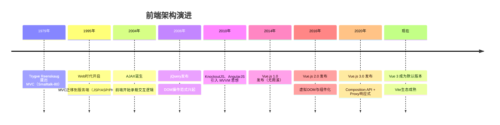
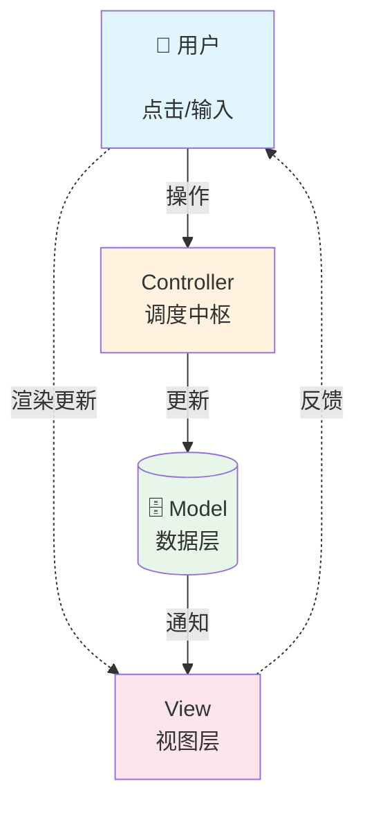
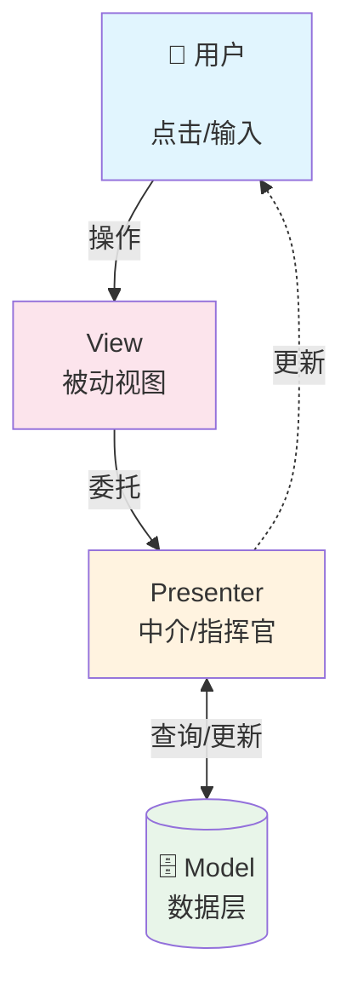
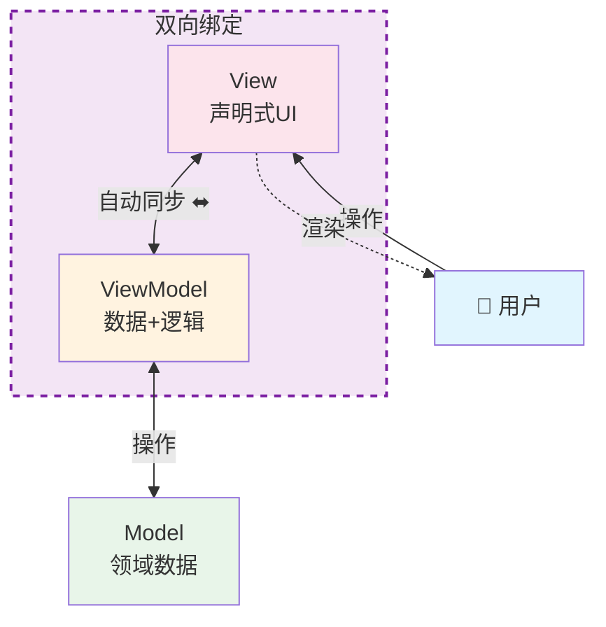
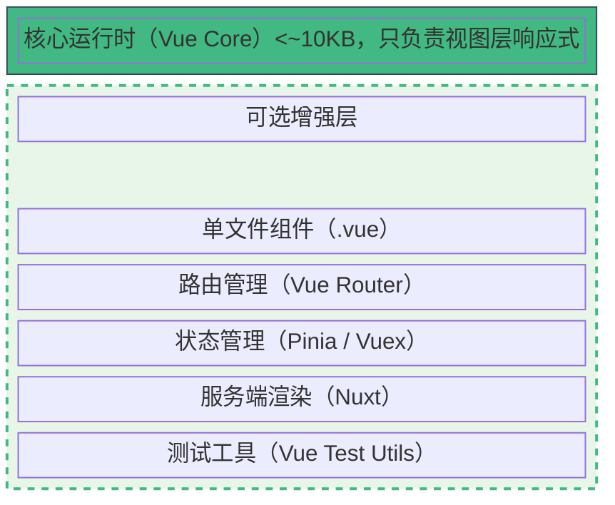
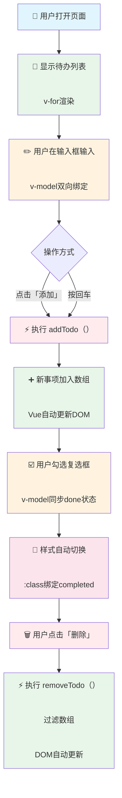

# Vue.js认识与基础

## Vue.js发展概述

### 前端架构演进



---

#### MVC（Model-View-Controller）



**特点**：控制器是核心，View和Model不直接通信（早期Web实现中常有View直接读取Model的情况）。

**代表**：Spring MVC、Django、Ruby on Rails

---

#### MVP（Model-View-Presenter）



**特点**：View完全被动，所有逻辑都在Presenter中；便于单元测试，但Presenter容易臃肿。

**代表**：早期Android开发、部分WinForms应用

---

#### MVVM（Model-View-ViewModel）



**特点**：View与ViewModel通过「双向绑定」自动同步，开发者只需操作数据，无需手动操作DOM。

**代表**：Vue.js、Angular、KnockoutJS、WPF

---

### 渐进式框架与响应式系统

**渐进式框架（Progressive Framework）**



**响应式系统（Reactivity System）**

Vue 3 使用 ES6 `Proxy` 实现响应式：

```javascript
// 原理示意（非真实源码）
const state = new Proxy({ count: 0 }, {
    set(target, key, value) {
        target[key] = value;
        // 自动触发依赖的视图更新
        triggerUpdate();
        return true;
    }
});

state.count++; // 视图自动刷新，无需手动操作DOM
```

---

## 开发准备与环境调试

### 方式一：CDN引入（适合学习与快速原型）

```html
<!DOCTYPE html>
<html lang="zh-CN">
<head>
    <meta charset="UTF-8">
    <title>Vue CDN</title>
</head>
<body>
    <div id="app">
        <h1>{{ message }}</h1>
    </div>

    <!-- 引入 Vue 3 全局构建版本 -->
    <script src="https://unpkg.com/vue@3/dist/vue.global.js"></script>

    <script>
        const { createApp } = Vue;

        createApp({
            data() {
                return {
                    message: 'Hello Vue 3!'
                }
            }
        }).mount('#app');
    </script>
</body>
</html>
```

**CDN 链接选择：**

| 链接 | 用途 |
|------|------|
| `vue.global.js` | 开发环境，含完整警告和调试信息 |
| `vue.global.prod.js` | 生产环境，已压缩 |
| `vue.esm-browser.js` | 浏览器原生 ES Module 方式 |

---

### 方式二：npm创建工程化项目（适合生产开发）

```bash
# 创建 Vue 3 项目（基于 Vite）
npm create vue@latest

# 交互式选项示例
# ✔ Project name: vue-demo
# ✔ Add TypeScript? … No
# ✔ Add JSX Support? … No
# ✔ Add Vue Router? … No      ← 本讲暂不引入
# ✔ Add Pinia? … No           ← 本讲暂不引入
# ✔ Add Vitest? … No
# ✔ Add Cypress? … No
# ✔ Add ESLint? … Yes
# ✔ Add Prettier? … Yes

# 进入目录并启动
 cd vue-demo
 npm install
 npm run dev
```

**生成的目录结构：**

```
vue-demo/
├── public/           # 静态资源（不经过构建）
├── src/
│   ├── assets/       # 样式、图片等（会被构建处理）
│   ├── components/   # 可复用组件
│   ├── App.vue       # 根组件
│   └── main.js       # 应用入口
├── index.html        # HTML模板
├── package.json
└── vite.config.js    # Vite 构建配置
```

---

### Vue DevTools 安装与使用

**安装方式：**
1. Chrome 商店搜索 "Vue.js devtools"
2. Firefox 附加组件搜索 "Vue.js devtools"
3. 注意：Vue 3 需要安装 v6+ 版本

**核心功能：**

| 面板 | 功能 |
|------|------|
| **Components** | 查看组件树、Props、Data、Computed |
| **Timeline** | 记录性能事件、组件渲染耗时 |
| **Inspector** | 实时编辑组件状态，观察响应式变化 |

---

## Vue.js模板语法

### 1. 文本插值（Mustache）

```html
<div id="app">
    <!-- 基本插值 -->
    <p>{{ message }}</p>

    <!-- JavaScript 表达式（不是语句） -->
    <p>{{ count + 1 }}</p>
    <p>{{ message.toUpperCase() }}</p>
    <p>{{ ok ? '是' : '否' }}</p>

    <!-- 一次性插值，数据变化不更新 -->
    <p v-once>{{ message }}</p>
</div>
```

---

### 2. 原始 HTML（谨慎使用）

```html
<div id="app">
    <!-- 默认转义为文本 -->
    <p>{{ rawHtml }}</p>        <!-- 输出: <span style="color:red">红</span> -->

    <!-- 渲染为真实 HTML（注意 XSS 风险） -->
    <p v-html="rawHtml"></p>   <!-- 输出: 红色的"红"字 -->
</div>

<script>
    createApp({
        data() {
            return {
                rawHtml: '<span style="color:red">红</span>'
            }
        }
    }).mount('#app');
</script>
```

⚠️ **安全警告**：`v-html` 只应在可信内容上使用，永远不要用于用户提交的内容。

---

### 3. 内置指令（80/20 核心指令）

#### `v-bind` — 属性绑定

```html
<!-- 完整语法 -->


<!-- 简写（强烈推荐） -->


<!-- 动态属性名 -->
<a :[attrName]="url">链接</a>

<!-- 绑定对象 -->
<div :class="{ active: isActive, 'text-danger': hasError }"></div>
```

---

#### `v-on` — 事件监听

```html
<!-- 完整语法 -->
<button v-on:click="increment">+1</button>

<!-- 简写（强烈推荐） -->
<button @click="increment">+1</button>

<!-- 内联事件处理 -->
<button @click="count++">直接操作</button>

<!-- 传递事件对象 -->
<button @click="handleClick($event)">传参</button>

<!-- 事件修饰符 -->
<form @submit.prevent="onSubmit">        <!-- 阻止默认提交 -->
<input @keyup.enter="onEnter">          <!-- 回车键触发 -->
<div @click.stop="onClick">             <!-- 阻止冒泡 -->
```

---

#### `v-if` / `v-else-if` / `v-else` / `v-show` — 条件渲染

```html
<!-- 条件渲染（DOM 真正创建/销毁） -->
<p v-if="score >= 90">优秀</p>
<p v-else-if="score >= 60">及格</p>
<p v-else>不及格</p>

<!-- v-show（仅切换 CSS display） -->
<p v-show="isVisible">始终存在，只是隐藏</p>
```

| 指令 | 原理 | 适用场景 |
|------|------|----------|
| `v-if` | 条件为假时不渲染/销毁组件 | 切换频率低，或需要触发生命周期钩子 |
| `v-show` | 始终渲染，仅切换 `display` | 频繁切换显示/隐藏 |

---

#### `v-for` — 列表渲染

```html
<ul>
    <!-- 遍历数组 -->
    <li v-for="item in items" :key="item.id">
        {{ item.name }}
    </li>

    <!-- 带索引 -->
    <li v-for="(item, index) in items" :key="item.id">
        {{ index + 1 }}. {{ item.name }}
    </li>

    <!-- 遍历对象 -->
    <li v-for="(value, key) in user" :key="key">
        {{ key }}: {{ value }}
    </li>
</ul>
```

⚠️ **必须绑定 `:key`**：唯一标识帮助 Vue 高效更新虚拟 DOM。

---

#### `v-model` — 表单双向绑定

```html
<div id="app">
    <!-- 文本输入 -->
    <input v-model="message" placeholder="输入内容">
    <p>你输入了：{{ message }}</p>

    <!-- 复选框 -->
    <input type="checkbox" v-model="isChecked"> 同意协议

    <!-- 单选按钮 -->
    <input type="radio" v-model="gender" value="男"> 男
    <input type="radio" v-model="gender" value="女"> 女

    <!-- 下拉框 -->
    <select v-model="selected">
        <option disabled value="">请选择</option>
        <option>北京</option>
        <option>上海</option>
    </select>
</div>

<script>
    createApp({
        data() {
            return {
                message: '',
                isChecked: false,
                gender: '',
                selected: ''
            }
        }
    }).mount('#app');
</script>
```

**`v-model` 本质**：是 `:value` + `@input` 的语法糖。

---

### 4. 其他指令（自学清单）

| 指令 | 作用 | 自学优先级 |
|------|------|-----------|
| `v-text` | 更新元素的 textContent（等价于 `{{ }}`，但不会闪烁） | ⭐⭐ |
| `v-pre` | 跳过编译，显示原始 Mustache 标签 | ⭐ |
| `v-cloak` | 配合 CSS 解决插值闪烁问题 | ⭐ |
| `v-slot` / `#` | 插槽内容分发（组件进阶） | ⭐⭐⭐ |
| `v-memo` | 条件缓存子树（性能优化） | ⭐ |

---

## Vue.js入门级应用实践

本节通过完整的案例**「待办事项清单（Todo List）」**，从纯 HTML 开始，逐步引入 Vue 3 的核心特性。

**文件结构：**
```
lecture10-examples/todo-steps/
├── step1-cdn-setup.html       # 阶段1：CDN引入与数据绑定
├── step2-interpolation.html   # 阶段2：插值与v-bind
├── step3-events.html          # 阶段3：事件处理与v-model
└── step4-complete.html        # 阶段4：条件渲染与列表渲染
```

---

### 阶段1：CDN引入与创建应用

**学习目标**：
- 掌握 Vue 3 CDN 引入方式
- 理解 `createApp` 与 `mount`
- 认识 `data()` 函数

```html
<!DOCTYPE html>
<html lang="zh-CN">
<head>
    <meta charset="UTF-8">
    <meta name="viewport" content="width=device-width, initial-scale=1.0">
    <title>阶段1：Vue基础结构</title>
</head>
<body>
    <div id="app">
        <!-- Vue 管理这个 div 内部的所有内容 -->
        <h1>{{ appTitle }}</h1>
    </div>

    <!-- 1. 引入 Vue 3 -->
    <script src="https://unpkg.com/vue@3/dist/vue.global.js"></script>

    <script>
        // 2. 从 Vue 对象中解构出 createApp
        const { createApp } = Vue;

        // 3. 创建应用实例
        const app = createApp({
            // data 必须是函数，返回一个对象
            data() {
                return {
                    appTitle: '我的待办清单'
                }
            }
        });

        // 4. 挂载到 DOM
        app.mount('#app');
    </script>
</body>
</html>
```

#### 核心概念速查

| 概念 | 说明 |
|------|------|
| `createApp()` | 创建一个 Vue 应用实例 |
| `.mount('#app')` | 将应用挂载到 DOM 元素上（CSS选择器） |
| `data()` | 定义响应式数据，必须是函数返回对象 |
| `{{ }}` | Mustache 插值语法，渲染 data 中的值 |

#### 课堂练习
1. 修改 `appTitle` 的值，观察页面实时变化
2. 在 `data()` 中新增一个字段 `userName`，并在模板中显示
3. 打开 Vue DevTools，观察 Components 面板中的数据

---

### 阶段2：插值与属性绑定

**学习目标**：
- 掌握 `v-bind` 绑定 HTML 属性
- 理解 `v-bind` 简写 `:`
- 使用对象语法绑定 class

```html
<!DOCTYPE html>
<html lang="zh-CN">
<head>
    <meta charset="UTF-8">
    <title>阶段2：插值与v-bind</title>
    <style>
        .completed { text-decoration: line-through; color: #999; }
        .urgent { color: #e74c3c; font-weight: bold; }
    </style>
</head>
<body>
    <div id="app">
        <h1>{{ appTitle }}</h1>

        <!-- v-bind 绑定 src 属性 -->
        

        <!-- 绑定 class（对象语法）-->
        <p :class="{ completed: isDone, urgent: isUrgent }">
            这是一项待办任务
        </p>

        <!-- 绑定 style（对象语法）-->
        <p :style="{ fontSize: fontSize + 'px', color: textColor }">
            动态样式文本
        </p>
    </div>

    <script src="https://unpkg.com/vue@3/dist/vue.global.js"></script>
    <script>
        const { createApp } = Vue;

        createApp({
            data() {
                return {
                    appTitle: '我的待办清单',
                    logoUrl: 'https://vuejs.org/images/logo.png',
                    logoAlt: 'Vue Logo',
                    isDone: true,
                    isUrgent: false,
                    fontSize: 18,
                    textColor: '#3498db'
                }
            }
        }).mount('#app');
    </script>
</body>
</html>
```

#### 课堂练习
1. 将 `isDone` 改为 `false`，观察文本样式变化
2. 添加一个按钮，点击切换 `isUrgent` 的值（提示：使用 `@click`）
3. 尝试绑定一个 `<a>` 标签的 `href` 属性

---

### 阶段3：事件处理与双向绑定

**学习目标**：
- 掌握 `v-on` / `@` 事件监听
- 理解 `v-model` 双向绑定
- 编写方法函数 `methods`

```html
<!DOCTYPE html>
<html lang="zh-CN">
<head>
    <meta charset="UTF-8">
    <title>阶段3：事件与v-model</title>
    <style>
        body { font-family: 'Microsoft YaHei', sans-serif; padding: 20px; }
        input { padding: 8px; width: 200px; }
        button { padding: 8px 16px; margin-left: 8px; }
    </style>
</head>
<body>
    <div id="app">
        <h1>{{ appTitle }}</h1>

        <!-- v-model 双向绑定输入框 -->
        <input v-model="newTodo" @keyup.enter="addTodo" placeholder="输入待办事项，按回车添加">
        <button @click="addTodo">添加</button>

        <!-- 显示当前输入（调试用，实际可删除） -->
        <p>当前输入：{{ newTodo }}</p>
    </div>

    <script src="https://unpkg.com/vue@3/dist/vue.global.js"></script>
    <script>
        const { createApp } = Vue;

        createApp({
            data() {
                return {
                    appTitle: '我的待办清单',
                    newTodo: ''
                }
            },
            // methods 中定义事件处理函数
            methods: {
                addTodo() {
                    // 去除首尾空格
                    const text = this.newTodo.trim();

                    if (text === '') {
                        alert('请输入内容！');
                        return;
                    }

                    console.log('新增待办：', text);
                    // 后续会将此项加入列表
                    this.newTodo = ''; // 清空输入框
                }
            }
        }).mount('#app');
    </script>
</body>
</html>
```

#### 关键知识点

```javascript
// methods 中的 this 指向当前组件实例
methods: {
    addTodo() {
        this.newTodo;      // 访问 data 中的数据
        this.addTodo();    // 调用其他方法
    }
}
```

| 语法 | 说明 |
|------|------|
| `@click="handler"` | 点击时调用 handler 方法 |
| `@click="count++"` | 内联语句 |
| `@keyup.enter` | 按键修饰符，仅回车触发 |
| `v-model="data"` | 输入框与数据双向同步 |

#### 课堂练习
1. 添加一个 `@focus` 事件，输入框获得焦点时在控制台输出日志
2. 修改 `addTodo`，限制输入长度不超过 20 个字符
3. 添加一个「清空」按钮，点击后清空输入框

---

### 阶段4：条件渲染与列表渲染

**学习目标**：
- 掌握 `v-for` 渲染列表
- 理解 `:key` 的重要性
- 综合运用 `v-if` 与 `v-for`

```html
<!DOCTYPE html>
<html lang="zh-CN">
<head>
    <meta charset="UTF-8">
    <title>阶段4：完整Todo List</title>
    <style>
        body { font-family: 'Microsoft YaHei', sans-serif; max-width: 500px; margin: 0 auto; padding: 20px; }
        .todo-item { display: flex; align-items: center; padding: 10px; border-bottom: 1px solid #eee; }
        .todo-item.completed span { text-decoration: line-through; color: #999; }
        input[type="text"] { padding: 8px; width: 70%; }
        button { padding: 8px 12px; margin-left: 8px; cursor: pointer; }
        .empty { color: #999; text-align: center; padding: 20px; }
    </style>
</head>
<body>
    <div id="app">
        <h1>{{ appTitle }}</h1>

        <!-- 输入区 -->
        <div>
            <input v-model="newTodo" @keyup.enter="addTodo" placeholder="输入待办事项">
            <button @click="addTodo">添加</button>
        </div>

        <!-- 统计 -->
        <p>共 {{ todos.length }} 项，已完成 {{ completedCount }} 项</p>

        <!-- 空列表提示 -->
        <p v-if="todos.length === 0" class="empty">暂无待办事项，添加一条吧！</p>

        <!-- 列表渲染 -->
        <ul v-else style="list-style: none; padding: 0;">
            <li
                v-for="todo in todos"
                :key="todo.id"
                class="todo-item"
                :class="{ completed: todo.done }"
            >
                <input type="checkbox" v-model="todo.done">
                <span style="flex: 1; margin-left: 10px;">{{ todo.text }}</span>
                <button @click="removeTodo(todo.id)">删除</button>
            </li>
        </ul>
    </div>

    <script src="https://unpkg.com/vue@3/dist/vue.global.js"></script>
    <script>
        const { createApp } = Vue;

        createApp({
            data() {
                return {
                    appTitle: '我的待办清单',
                    newTodo: '',
                    todos: [
                        { id: 1, text: '学习 Vue 模板语法', done: true },
                        { id: 2, text: '完成课后作业', done: false }
                    ],
                    nextId: 3
                }
            },
            computed: {
                // 计算属性：自动根据 todos 变化重新计算
                completedCount() {
                    return this.todos.filter(t => t.done).length;
                }
            },
            methods: {
                addTodo() {
                    const text = this.newTodo.trim();
                    if (!text) return;

                    this.todos.push({
                        id: this.nextId++,
                        text: text,
                        done: false
                    });
                    this.newTodo = '';
                },
                removeTodo(id) {
                    this.todos = this.todos.filter(t => t.id !== id);
                }
            }
        }).mount('#app');
    </script>
</body>
</html>
```

#### 完整功能流程图



---

## 学习检查清单

完成本讲后，你应该能够：

- [ ] 解释 MVC、MVP、MVVM 三种架构模式的区别
- [ ] 说明 Vue 3 响应式系统的基本原理（Proxy）
- [ ] 使用 CDN 方式引入 Vue 3 并创建应用
- [ ] 使用 `npm create vue@latest` 创建工程化项目
- [ ] 安装并使用 Vue DevTools 调试应用
- [ ] 使用 `{{ }}` 进行文本插值
- [ ] 使用 `v-bind`（`:`）绑定 HTML 属性
- [ ] 使用 `v-on`（`@`）监听 DOM 事件
- [ ] 使用 `v-model` 实现表单双向绑定
- [ ] 使用 `v-if` / `v-show` 进行条件渲染
- [ ] 使用 `v-for` 渲染列表，并正确绑定 `:key`
- [ ] 在 `data()` 中定义响应式数据
- [ ] 在 `methods` 中定义事件处理函数
